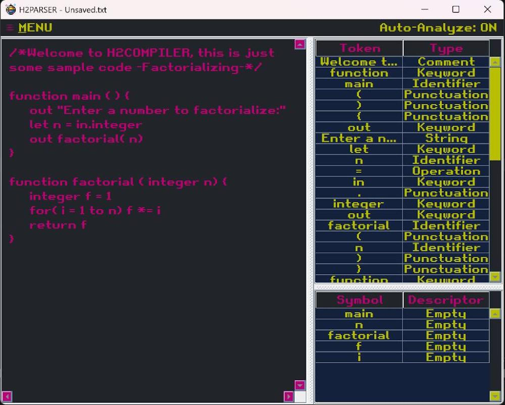
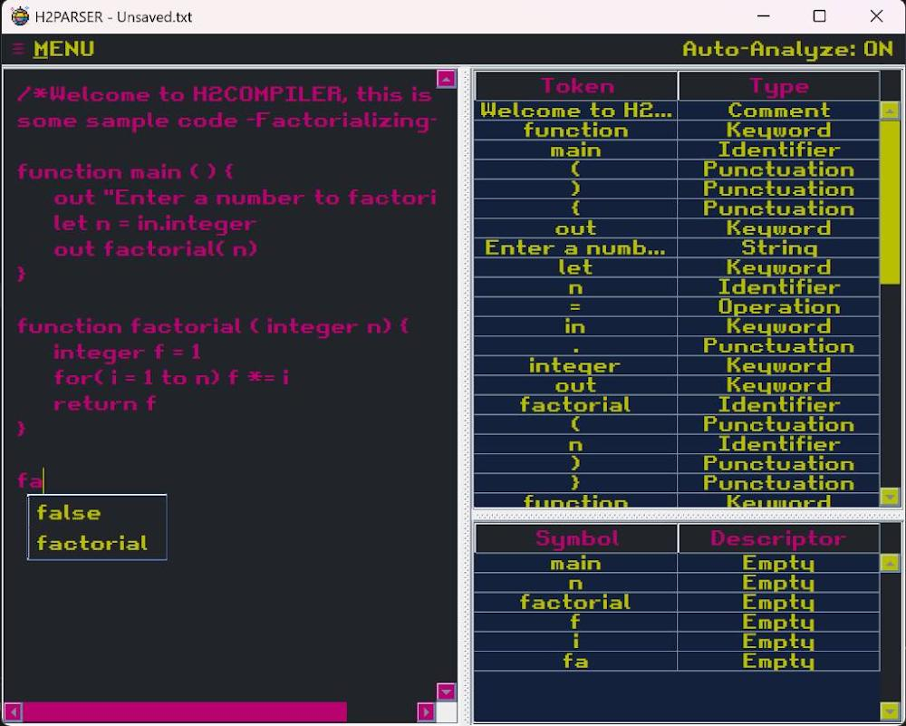
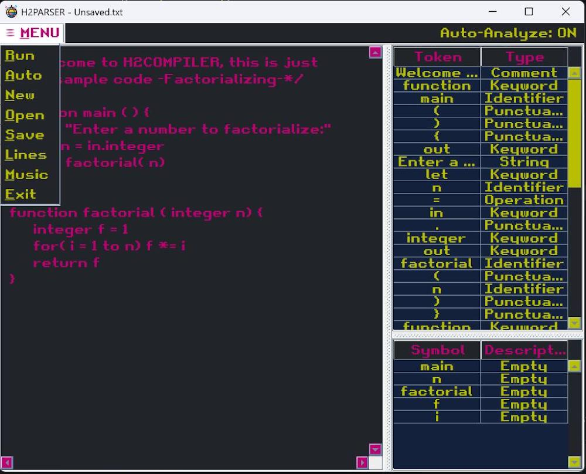

# H2Parser

An interactive, retro-styled desktop IDE and lexical analyzer designed to parse and tokenize custom programming language structures.

## Overview

**H2Parser** was originally conceived as a full compiler but was ultimately scaled to focus strictly on the core, foundational phase of compilation: **lexical analysis and parsing**. Built entirely in **Java**, this utility features a vibrant, custom retro-themed code canvas paired with classic 8-bit chip music and crunchy pixelated audio feedback for user menu actions. The system breaks source strings down into distinct token classifications, manages variable symbols, and provides automated, context-aware syntax suggestions in real time.

## Features

- **Granular Lexical Tokenization:** Instantly scans source inputs via `LexicalAnalyzer.java` to break structural text elements into categorized fields (_Keywords, Identifiers, Punctuation, Operations, Strings, and Comments_).
- **Automated Symbol Indexing:** Uses `Symbol.java` and `Table.java` matrices to construct active variable registries, continuously mapping key components (like `main`, `n`, `f`, `i`) alongside system descriptions.
- **Retro Audio Integration:** Features 8-bit synth chip tracks alongside retro sound effects map events triggered by interface interactions, running state updates, or menu navigation adjustments.
- **Intellisense Predictive Canvas:** Features real-time typing listeners that detect prefixes (e.g., typing `fa`) to immediately spawn retro-styled autocomplete popups suggesting legal keywords or tracking tokens (`false`, `factorial`).
- **Sidebar Action Drawer:** Contains integrated macro components overseeing environment persistence state loops (`New`, `Open`, `Save`), analytical steps (`Run`, `Lines`), tracking automation triggers (`Auto-Analyze`), and core utility options (`Music`, `Exit`).

## Tech Stack

- **Language:** Java (JDK 8 or higher)
- **UI Architecture:** Custom-themed Java Swing / AWT desktop graphical layouts
- **Audio Pipeline:** Low-level digital synthesizer stream interfaces processing 8-bit sound blocks

## Project Structure

```bash
h2-parser/
├── screenshots/
│   ├── menu.jpg              # Toggle states panel overview
│   ├── overview.jpg          # Active multi-pane compiler tool canvas
│   └── recommendations.jpg   # Inline target predictive autocomplete overlay
├── src/
│   ├── assets/               # 8-bit background music tracks and pixelated sound elements
│   ├── Item.java             # Data mapping models for contextual variables
│   ├── LexicalAnalyzer.java  # Core computational tokenization and parsing logic
│   ├── Main.java             # Global initialization configuration window manager
│   ├── Symbol.java           # Structural layout tracking defined symbols
│   ├── Table.java            # Dynamic interface matrix binding data sets to rows
│   └── Token.java            # Class definitions containing word-type classifications
└── .gitignore                # Filters tracking metadata caches and temporary output directories
```

## Application Interface Mappings

### Analytical Engine & Autocomplete Triggers

 

_Figure 1: Source code stream parsing down to rigid table rows alongside context-aware inline autocomplete suggestions._

### Core Action Drawer Navigation



_Figure 2: Custom contextual controls menu handling document files, token evaluation checkpoints, and retro audio loops._

## Installation & Running Environments

### Prerequisites

- Java Development Kit (JDK) 8 or higher configured locally.
- A desktop environment layer capable of processing standard graphical component libraries.

### Quick Start Execution

- Clone the codebase package cleanly onto your destination terminal environment:

  ```bash
  git clone https://github.com
  ```

- Navigate straight into the root target `src/` directory space:

  ```bash
  cd h2-parser/src
  ```

- Compile all active development files together via your command line interface:

  ```bash
  javac *.java
  ```

- Boot up the visual IDE to activate the parser workbench sandbox window:
  ```bash
  java Main
  ```

## Author

H2SO4-1191 – Software Engineer
